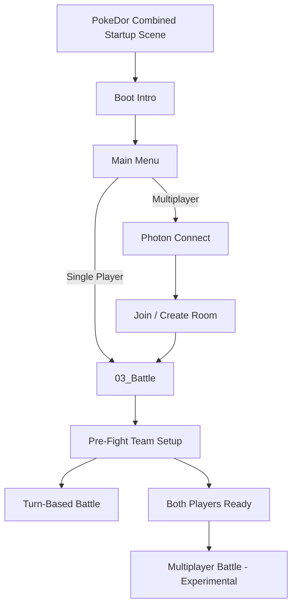
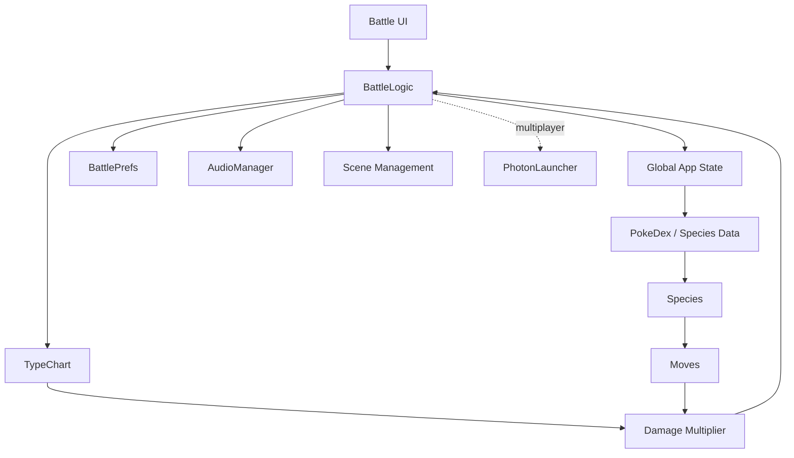

<div align="center">

# PokeDor

### A retro-inspired creature battler built in Unity

[](https://unity.com/)

[](https://www.photonengine.com/pun)


**Turn-based creature battles, team selection, type-based combat, a retro handheld UI, and an experimental online multiplayer layer.**

> PokeDor started as a Unity coursework project and is now being rebuilt and documented as a portfolio project: cleaner repository, reproducible setup, desktop/mobile builds, improved controls, repaired startup flow, improved multiplayer, and better technical documentation.

</div>

---

## Overview

**PokeDor** is a 2D turn-based creature-battling game written in **C#** with **Unity**.

The current playable flow is centered around a retro handheld-inspired interface. The game opens through a combined PokeDor startup scene, plays a short boot sequence, presents the main menu, and then enters the pre-fight and battle flow. Players can build a party, use typed attacks, switch active creatures, and interact with battle menus and options.

An online multiplayer path using **Photon PUN 2** is also present and is currently being repaired and hardened for the portfolio release.

The current game database defines **15 custom PokeDor species**, each with its own type, HP, moves, power values, and artwork.

---

## Media

> Gameplay screenshots and a short GIF/video are being added during the portfolio polish pass.

<!--
Planned portfolio media:
- docs/media/pokedor-hero.png
- docs/media/boot-intro.png
- docs/media/main-menu.png
- docs/media/team-selection.png
- docs/media/battle.png
- docs/media/multiplayer.png
- docs/media/gameplay.gif
-->

---

## Current Features

### Gameplay

- Turn-based creature battles
- Custom PokeDor species database
- Typed attacks and effectiveness multipliers
- HP and battle-state handling
- Six-member party support
- Creature switching during battle
- Pre-fight / team-selection flow
- Turn timer
- Battle log with typewriter-style text
- Win / lose flow
- Audio, music, SFX, and mute/options controls
- Trainer and creature artwork loaded at runtime
- Small easter-egg system

### UI / UX

- Retro handheld-inspired interface
- Boot intro, main menu, pre-fight, battle, options, and result states
- Unity uGUI + TextMesh Pro
- On-screen D-pad plus A/B-style controls
- Reusable UI prefabs and centralized UI reference binding

> **Control-system status:** the current D-pad/A/B navigation works partially but is being consolidated into a single navigation controller before the release builds. A stack-overflow bug in the current overlapping navigation implementations is also being fixed as part of this pass.

### Multiplayer foundation

PokeDor contains an experimental **Photon PUN 2** multiplayer flow:

1. Enter a player name.
2. Select a room number.
3. Connect to Photon.
4. Join or create a two-player room.
5. Load the battle scene.
6. Configure the pre-fight team.
7. Ready both players.
8. Start the multiplayer battle.

> **Current status:** the connection / room / pre-fight foundation exists, but multiplayer battle synchronization and the ready-state flow are still under active repair. Multiplayer should currently be considered **experimental**, not production-ready.

---

## Actual Runtime Flow



The current startup scene is:

```text
Assets/PokeDor_DorMandel_315313825_SP+MP.unity
```

That scene contains the boot layer and main-menu flow. The single-player button currently loads `03_Battle` directly.

The repository still contains older / supporting scenes such as `01_Menu` and `02_Overworld`, but **the overworld is not part of the current planned release flow**.

Before release, Unity Build Settings will be cleaned so the real startup scene is the first enabled scene and obsolete entries are removed from the player build.

---

## Battle Architecture



The project intentionally keeps most gameplay concepts as small C# components instead of embedding all behavior directly in scene objects.

---

## Example: Type Effectiveness

The combat system stores attack/defender relationships in a dictionary and falls back to a `1x` multiplier when no special relationship exists.

Examples currently implemented include:

| Attack | Defender | Multiplier |
|---|---|---:|
| Fire | Grass | 2.0x |
| Grass | Water | 2.0x |
| Water | Fire | 2.0x |
| Electric | Water | 2.0x |
| Rock | Fire | 2.0x |
| Fire | Water | 0.5x |
| Grass | Fire | 0.5x |
| Water | Grass | 0.5x |

This keeps effectiveness rules separate from the battle loop and makes the table easy to extend.

---

## Project Structure

```text
PokeDor/
├── Assets/
│   ├── PokeDor_DorMandel_315313825_SP+MP.unity   # Current startup/menu scene
│   ├── Prefabs/                                   # Reusable game/UI objects
│   ├── Resources/                                 # Runtime-loaded creatures, trainers, audio
│   ├── Scenes/                                    # Battle + older/supporting scene assets
│   ├── Scripts/
│   │   ├── EasterEgg/                             # Easter-egg behaviours
│   │   ├── Managers/                              # Global/menu/game-mode logic
│   │   ├── Photon/                                # Multiplayer connection and failsafes
│   │   ├── SinglePlayerScripts/
│   │   │   ├── Battle/                            # Turn-based battle system
│   │   │   ├── Data/                              # Species, moves, types and PokeDex
│   │   │   └── Overworld/                         # Legacy/supporting overworld code
│   │   └── UI/                                    # Buttons, sliders, options and UI helpers
│   ├── Sprites/
│   ├── TextMesh Pro/
│   └── Photon/                                    # Photon PUN runtime/plugin files
├── Packages/
├── ProjectSettings/
├── .gitignore
└── README.md
```

Unity-generated folders such as `Library`, `Temp`, `Logs`, `Build`, and `UserSettings` are intentionally excluded from version control.

---

## Controls

PokeDor uses an on-screen handheld control layout:

| Control | Intended Action |
|---|---|
| D-pad Up / Down | Move between menu choices |
| D-pad Left / Right | Horizontal navigation where supported |
| `A` | Confirm / activate selected action |
| `B` | Back / cancel |

> The controls above describe the intended release behavior. The current implementation is being refactored so **one controller owns all D-pad/A/B navigation**, avoiding competing EventSystem handlers and recursion.

---

## Tech Stack

| Technology | Role |
|---|---|
| **Unity 2022.3.62f1 LTS** | Game engine |
| **C#** | Gameplay and systems programming |
| **Unity uGUI** | Runtime UI |
| **TextMesh Pro** | UI typography |
| **Photon PUN 2** | Multiplayer foundation |
| **Git / GitHub** | Version control and portfolio delivery |

---

## Getting Started

### Requirements

- Unity Hub
- **Unity 2022.3.62f1 LTS**
- Git

### Clone

```bash
git clone https://github.com/DorManDel/PokeDor.git
cd PokeDor
```

Then open the repository folder through **Unity Hub** using Unity `2022.3.62f1`.

For the current runtime flow, open:

```text
Assets/PokeDor_DorMandel_315313825_SP+MP.unity
```

and enter Play Mode.

The intended test path is:

```text
Boot Intro
→ Main Menu
→ Single Player
→ Pre-Fight Team Selection
→ Battle
```

---

## Photon Multiplayer Setup

The repository intentionally does **not** publish the project's local `PhotonServerSettings.asset` / live Photon application configuration.

If you want to test multiplayer after cloning:

1. Create or use your own Photon account/application.
2. Configure Photon PUN inside Unity with your own App ID.
3. Allow Unity/PUN to create your local `PhotonServerSettings.asset`.
4. Run two clients and use the same room number.

The local Photon settings asset is ignored by Git so credentials/configuration are not accidentally committed.

> Multiplayer is currently under repair. The goal of the portfolio pass is to make matchmaking, readiness, team exchange, battle state, turns, switching, disconnects, and rematches deterministic across both clients.

---

## Build Targets

| Target | Status |
|---|---|
| Unity Editor | ✅ Current development target |
| Windows x64 | 🛠 Next release build after runtime fixes |
| Android | 🛠 Planned immediately after Windows validation |
| WebGL | 🧪 Planned compatibility pass after desktop/mobile |
| Online Multiplayer | 🚧 Experimental / being repaired |

Build downloads and a playable web link will be added here once the release builds are verified.

---

## Portfolio Release Plan

This is the current release order:

- [x] Move source project into Git/GitHub
- [x] Add Unity-focused `.gitignore`
- [x] Remove local backups/configuration from the public repository
- [x] Add portfolio README foundation
- [x] Correct README to match the actual runtime flow
- [ ] Repair and verify the boot intro
- [ ] Fix the UI navigation `StackOverflowException`
- [ ] Consolidate D-pad / A / B into one navigation controller
- [ ] Test the full single-player flow without runtime errors
- [ ] Capture gameplay screenshots and demo GIF/video
- [ ] Perform final README accuracy/media pass
- [ ] Clean Unity Build Settings for the real startup scene
- [ ] Produce and verify Windows x64 build
- [ ] Produce and verify Android build
- [ ] Add GitHub Releases and downloadable builds
- [ ] Run WebGL compatibility/build pass

### Multiplayer follow-up

- [ ] Repair Photon ready-state logic
- [ ] Synchronize multiplayer team data
- [ ] Synchronize battle actions and state
- [ ] Add disconnect/reconnect/error handling

---

## What This Project Demonstrates

PokeDor is useful to me as more than a small game. It is a place to demonstrate several software-engineering concepts inside one Unity project:

- separation between data, gameplay logic, UI and networking
- data-driven entity creation
- dictionaries and lookup tables for game rules
- event-driven UI/gameplay communication
- coroutines for timed game flow
- runtime resource loading and caching
- reusable prefabs
- singleton/global-state tradeoffs
- scene lifecycle management
- defensive guards and failsafe paths
- UI EventSystem/navigation debugging
- multiplayer state synchronization problems
- cross-platform release engineering
- Git-based project cleanup and documentation

Part of the portfolio work is intentionally documenting not only **what works**, but also **what needs refactoring and why**.

---

## Repository Philosophy

The repository is being kept reproducible and intentionally excludes generated/local-only files. A clean clone should contain the source of truth required to reconstruct the Unity project without committing Unity's generated cache folders or private multiplayer configuration.

The long-term goal is:

```text
clone → open in Unity → configure optional Photon credentials → run → build
```

---

## Disclaimer

PokeDor is a **fan-made educational/portfolio project** inspired by classic creature-battling games. It is not affiliated with, endorsed by, or sponsored by Nintendo, Game Freak, The Pokémon Company, or Photon Engine.

All original PokeDor-specific code, custom creatures, project structure, and portfolio documentation in this repository are presented for educational and portfolio purposes. Third-party packages and assets remain subject to their respective licenses.

---

<div align="center">

### Built, broken, debugged, and rebuilt with Unity + C#.

**Current milestone:** boot intro → navigation fix → full test → Windows → Android.

</div>
